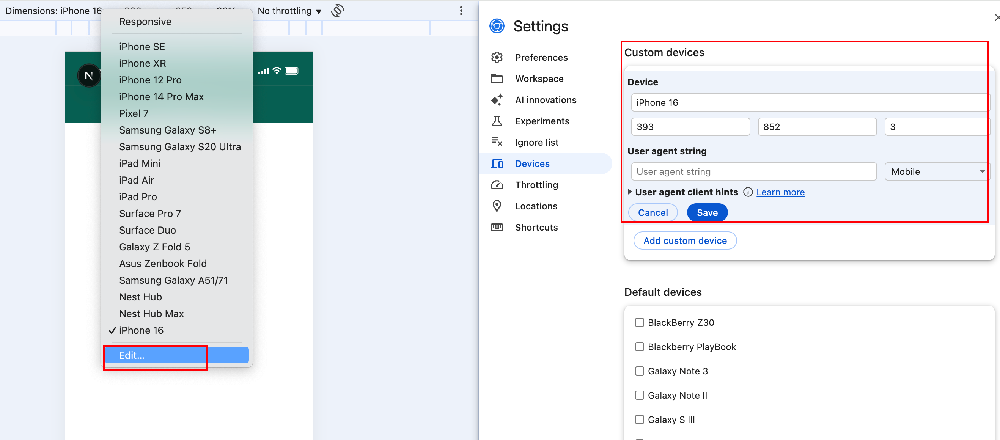
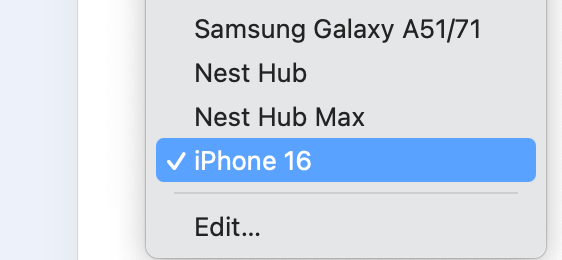

# Flow
Design 2 & Dynamic Content Design Team Project

## Coded App
1. Clone or download the ZIP file to your local machine.
2. Open the root app folder in your terminal, then run:
   1. npm install
   2. npm run dev
3. Open the app in your browser. Right-click anywhere on the page and select "Inspect". Then, follow the image below to add a custom device in the settings and select it.

## Style Guide
Click on "Code" and then "Download ZIP" to download the files. After unzipping, open the "style_guide" folder and open the "index.html" file to view the style guide.
